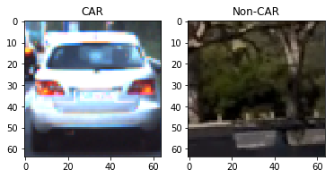
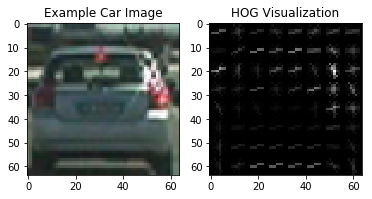
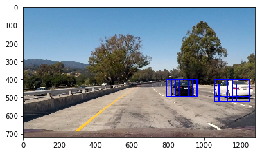
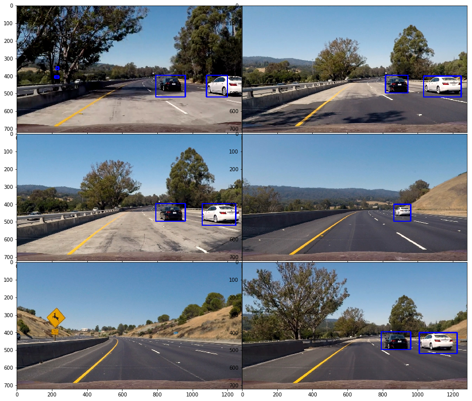
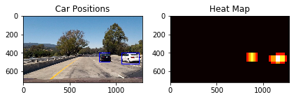

## Writeup Template
### You can use this file as a template for your writeup if you want to submit it as a markdown file, but feel free to use some other method and submit a pdf if you prefer.

---

**Vehicle Detection Project**

The goals / steps of this project are the following:

* Perform a Histogram of Oriented Gradients (HOG) feature extraction on a labeled training set of images and train a classifier Linear SVM classifier
* Optionally, you can also apply a color transform and append binned color features, as well as histograms of color, to your HOG feature vector. 
* Note: for those first two steps don't forget to normalize your features and randomize a selection for training and testing.
* Implement a sliding-window technique and use your trained classifier to search for vehicles in images.
* Run your pipeline on a video stream (start with the test_video.mp4 and later implement on full project_video.mp4) and create a heat map of recurring detections frame by frame to reject outliers and follow detected vehicles.
* Estimate a bounding box for vehicles detected.

## [Rubric](https://review.udacity.com/#!/rubrics/513/view) Points

### Here I will consider the rubric points individually and describe how I addressed each point in my implementation.  

---
### Writeup / README

#### 1. Provide a Writeup / README that includes all the rubric points and how you addressed each one.  You can submit your writeup as markdown or pdf.  [Here](https://github.com/udacity/CarND-Vehicle-Detection/blob/master/writeup_template.md) is a template writeup for this project you can use as a guide and a starting point.  

You're reading it!

### Histogram of Oriented Gradients (HOG)

#### 1. Explain how (and identify where in your code) you extracted HOG features from the training images.

The code for this step is contained in the code cell number 10 of the IPython notebook. 

I started by reading in all the `vehicle` and `non-vehicle` images.  Here is an example of one of each of the `vehicle` and `non-vehicle` classes:

I then explored different color spaces and different `skimage.hog()` parameters (`orientations`, `pixels_per_cell`, and `cells_per_block`).  I grabbed random images from each of the two classes and displayed them to get a feel for what the `skimage.hog()` output looks like.

Here is an example using the `RGB` color space and HOG parameters of `orientations=9`, `pixels_per_cell=(8, 8)` and `cells_per_block=(2, 2)` with HOG_Channel 'ALL':

#### 2. Explain how you settled on your final choice of HOG parameters.

I started of with `RGB` color space and tried different color spaces. Out of which I used `LUV` color space for my final pipeline. By using this color space I got more test accuracy than any other color space. 

#### 3. Describe how (and identify where in your code) you trained a classifier using your selected HOG features (and color features if you used them).

I used LinearSVC() for training my data set.
I started with only using color features(Color classify).  With color classify I could acheive a test accuracy of only 90.74%.
Then I used HOG Features for my classification. With HOG classify I could acheive a test accuracy of 96.45%
Finally I combined both HOG features and color features for my final pipeline. With combined features I could acheive a test accuracy of 98.48%

### Sliding Window Search

####1. Describe how (and identify where in your code) you implemented a sliding window search.  How did you decide what scales to search and how much to overlap windows?

The code for this step is contained in the code cell numbers 104,105,110 and 114 of the IPython notebook.
I started applying sliding windows search on test images with y coordinates from (400,700) with scale 1.5. This scale suited well for some of the test images. But didnot work well on images where car is little far away in the front. I chose several frames ranging from 300-700 with different scales ranging from 1.0 to 3.5. This gave me good results as shown below

####2. Show some examples of test images to demonstrate how your pipeline is working.  What did you do to optimize the performance of your classifier?

Ultimately I searched on two scales using 'LUV' 3-channel HOG features plus spatially binned color and histograms of color in the feature vector, which provided a nice result.  Here are some example images:

---

### Video Implementation

####1. Provide a link to your final video output.  Your pipeline should perform reasonably well on the entire project video (somewhat wobbly or unstable bounding boxes are ok as long as you are identifying the vehicles most of the time with minimal false positives.)
Here's a [link to my video result](./project_video_out.mp4)

####2. Describe how (and identify where in your code) you implemented some kind of filter for false positives and some method for combining overlapping bounding boxes.

I recorded the positions of positive detections in each frame of the video.  From the positive detections I created a heatmap and then thresholded that map to identify vehicle positions.  I then used `scipy.ndimage.measurements.label()` to identify individual blobs in the heatmap.  I then assumed each blob corresponded to a vehicle.  I constructed bounding boxes to cover the area of each blob detected.  

Here's an example result showing the heatmap from a series of frames of video, the result of `scipy.ndimage.measurements.label()` and the bounding boxes then overlaid on the last frame of video:

### Here are six frames and their corresponding heatmaps:

### Here is the output of `scipy.ndimage.measurements.label()` on the integrated heatmap from all six frames:

---

###Discussion

####1. Briefly discuss any problems / issues you faced in your implementation of this project.  Where will your pipeline likely fail?  What could you do to make it more robust?

One of the major problem I faced was regarding scaling the images. I didnot take care of this at the beginning, I was using both cv2.imread and mpimg.imread for training and testing. Due to this my feature extraction went wrong. I later fixed this.

The second major challenge was deteriming the frame's Y coordinates and selecting the right scale.

As you see in the final output video, there are few false positives detected. Also my code is not able to detect the cars in the opposite lane. I think my model can be more robust to detect the cars in the opposite lanes. having more training data set might help my model in Identifying more cars and avoid false positives.

